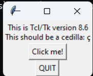

# GIF Generator
**Goal:** Want to create a GIF generator to post GIF of my project on my GitHub repo. 

**Objective:**  Create a your own reliable GIF Generator while learning the process of how GIFs work. This project will also allow you to new python libraries such as `Pillow`, `MoviePy`, and `Tkinter`. 


## Install Required Libraries 
1. Pillow (PIL)
   + Library for Image Processing 
2. MoviePy
   + Works with video files and GIFs
3. Tkinter
   + Helps create a basic user interface
   + Having trouble install this library


```bash 
pip install pillow moviepy tkinter  # install all 3 libraries
```

---
### Tip
If you're running into an issue where you're having trouble installing `Tkinter` python library, run the follow code in your terminal to check if it's already installed:
```bash
python -m tkinter
```
Once you've ran the previous line of code in the terminal you should recieve a GUI pop up, which tells you that the library is already installed.



[Tkinter Library Documentation ](https://docs.python.org/3/library/tkinter.html)

---

## GIF Generator Use Pillow

```py
images[0].save(
    "output.gif", save_all=True, append_images=images[1:], duration=500, loop=0
)
```
+ `duration` controles how long the frame is displayed in **milliseconds**
+ `save_all` ensures that all the images are saved in the GIF
+ `loop = 0` is to set GIF to run infinitely

## Resource 
+ [Pillow Library Documentation](https://pillow.readthedocs.io/en/stable/)
+ 
### Images
+ Photo by <a href="https://unsplash.com/@buddhaelemental3d?utm_content=creditCopyText&utm_medium=referral&utm_source=unsplash">Buddha Elemental 3D</a> on <a href="https://unsplash.com/photos/a-picture-of-a-blue-flower-on-a-black-background-xmaRg3iP2vM?utm_content=creditCopyText&utm_medium=referral&utm_source=unsplash">Unsplash</a>
+ Photo by <a href="https://unsplash.com/@buddhaelemental3d?utm_content=creditCopyText&utm_medium=referral&utm_source=unsplash">Buddha Elemental 3D</a> on <a href="https://unsplash.com/photos/a-computer-generated-image-of-a-blue-flower-u3hTrHzP14M ">Unsplash</a>
+ Photo by <a href="https://unsplash.com/@buddhaelemental3d?utm_content=creditCopyText&utm_medium=referral&utm_source=unsplash">Buddha Elemental 3D</a> on <a href="https://unsplash.com/photos/a-close-up-of-a-blue-flower-on-a-purple-background-C0Bvj5-8dnk?utm_content=creditCopyText&utm_medium=referral&utm_source=unsplash">Unsplash</a>
  